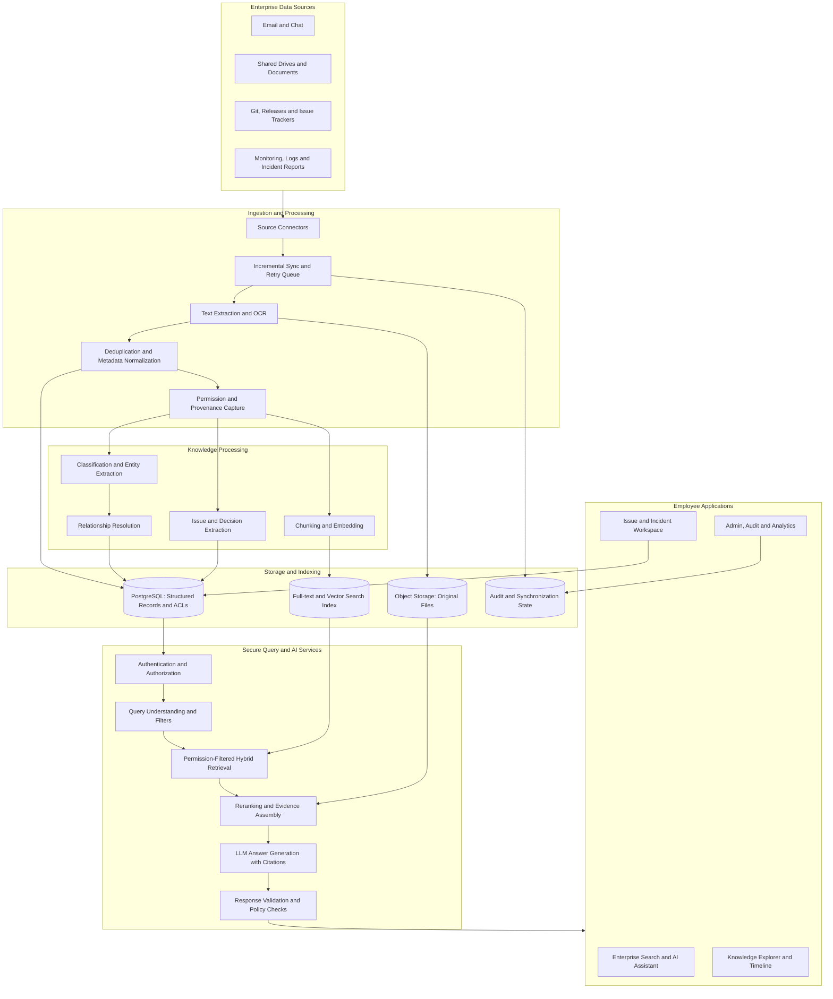

# Enterprise Knowledge Intelligence and Issue Management Platform
## CTO-Ready Solution Proposal

## 1. Executive Summary

Organizations distribute critical operational knowledge across emails, chat applications, shared drives, documents, source-control platforms, monitoring tools, and ticketing systems. This fragmentation makes it difficult to discover prior incidents, understand technical decisions, identify owners, track ongoing issues, and reuse lessons learned.

The proposed solution is a **secure, AI-powered Enterprise Knowledge Intelligence and Issue Management Platform**. It integrates organizational knowledge, makes it searchable through natural language, connects related issues and decisions, and provides controlled workflows for managing incidents and follow-up actions.

The platform combines three capabilities:

1. **Knowledge layer:** Ingests and organizes information from approved enterprise sources.
2. **Intelligence layer:** Uses hybrid search and retrieval-augmented generation (RAG) to return evidence-grounded answers with citations.
3. **Operations layer:** Converts important findings into structured issues, incidents, decisions, assignments, approvals, and auditable workflows.

The platform is designed to improve information discovery and accountability without giving AI unrestricted access to organizational systems.

## 2. Problem Definition

The organization faces six connected challenges:

- **Fragmented information:** Relevant details are scattered across communication channels, attachments, and documents.
- **Weak issue traceability:** Root causes, resolutions, ownership, status changes, and decisions are not consistently recorded.
- **Difficult discovery:** Similar incidents may use different terminology, making keyword-only search insufficient.
- **Loss of institutional knowledge:** Employees may repeat investigations because previous solutions are difficult to locate.
- **Security and governance risks:** Client, HR, security, and business information requires fine-grained access controls.
- **Limited accountability:** Assignments, approvals, announcements, escalations, and user activities may not be tracked consistently.

## 3. Proposed Solution

Build a centralized platform that connects enterprise information while preserving source provenance, access restrictions, and operational context.

### 3.1 Unified Knowledge Ingestion

Connect approved sources such as:

- Email and calendar systems
- Enterprise chat and collaboration tools
- Shared drives and document repositories
- Git repositories, pull requests, and release notes
- Issue trackers and incident-management systems
- Monitoring alerts, application logs, and post-incident reports

Ingestion should support incremental synchronization, retries, deduplication, deletion propagation, and source-specific permissions. Each imported item should retain its source identifier, source URL, timestamp, owner, project or client context, and access-control metadata where available.

### 3.2 AI-Powered Enterprise Search

Provide a single search interface supporting:

- Keyword and full-text search
- Semantic search based on meaning
- Hybrid retrieval combining lexical and vector results
- Filters for project, client, team, date, source, issue type, and status
- Related issue and document discovery
- Natural-language question answering with source citations

Example query:

> Find previous incidents where deployments caused database timeouts, show the root cause and resolution, and identify the team responsible.

The platform should return relevant authorized incidents, summarize their evidence, and link to the original records. It must distinguish confirmed facts from hypotheses and clearly state when evidence is incomplete.

### 3.3 Structured Issue and Incident Management

Allow employees to create or confirm structured records from conversations and documents.

Suggested fields:

- Issue or incident identifier
- Title and detailed description
- Category, severity, and priority
- Project, client, service, and environment
- Reporter, owner, and assigned team
- Status and status history
- Detection time, occurrence time, and resolution time
- Root cause and resolution
- Related conversations, logs, screenshots, and documents
- Approvals, follow-up actions, and lessons learned

AI may suggest classifications, summaries, related incidents, owners, and possible root causes. Authorized users should review consequential suggestions before they become authoritative records or trigger actions.

### 3.4 Knowledge Relationships and Organizational Memory

Connect entities and records, including:

- Issues ↔ incidents
- Incidents ↔ deployments and services
- Issues ↔ projects and clients
- Decisions ↔ discussions and documents
- Resolutions ↔ runbooks and knowledge articles
- Employees ↔ teams, ownership, and approvals

This relationship layer enables questions that require more than finding a matching paragraph, such as identifying recurring failures across projects or tracing why a technical decision was made.

### 3.5 Workflow, Notifications, and Governance

Support:

- Assignment and reassignment
- Status transitions and escalation
- Approval workflows
- Important announcements
- Reminders for overdue actions
- Change history and audit logs
- Dashboards for unresolved and recurring issues

Workflow actions must be authorized, validated by backend rules, and logged. The AI should not silently close incidents, approve sensitive changes, or modify permissions.

## 4. System Architecture

### Architecture principles

- The backend is the policy enforcement point. The model does not receive database credentials.
- Access checks are applied before protected content is supplied to the model.
- Source provenance is retained so answers can link back to original evidence.
- Ingestion and indexing run asynchronously so large imports do not block user requests.
- The initial system can use PostgreSQL full-text search and pgvector; a dedicated search engine can be added if measured scale or relevance requirements justify it.
- Components should be modular, but a well-structured modular backend is preferable to premature microservice proliferation.

## 5. Recommended Technology Stack

| Layer | Recommended option | Rationale |
|---|---|---|
| Frontend | React + TypeScript | Search, chat, issue management, and admin UI |
| Backend API | Go or Python FastAPI | Authentication, business logic, integrations, and workflows |
| Primary database | PostgreSQL | Relational data, transactions, metadata, and access-control records |
| Vector retrieval | pgvector initially | Embedding similarity within the existing database platform |
| Full-text search | PostgreSQL initially | A practical starting point for lexical search |
| Object storage | S3-compatible storage or managed equivalent | Original attachments, logs, and large files |
| Background jobs | Queue and worker system | Incremental ingestion, OCR, indexing, retries, and notifications |
| AI layer | LLM accessed through a controlled service | Query understanding, summarization, extraction, and answer generation |
| Identity | Enterprise SSO using OIDC or SAML where available | Central identity and authentication |
| Observability | Centralized logs, metrics, traces, and alerts | Reliability, troubleshooting, and operational visibility |

**Technology selection should be validated against** the organization's existing infrastructure, deployment constraints, data residency requirements, identity provider, licensing, budget, and expected volume.

## 6. Data Model

Use PostgreSQL as the system of record. Avoid storing the entire knowledge base in a single large JSON document.

Suggested entities and tables:

### Identity and access
- `users`
- `teams`
- `roles`
- `permissions`
- `resource_acl` or equivalent access-control mapping

### Sources and content
- `sources`
- `source_sync_state`
- `documents`
- `document_versions`
- `attachments`
- `document_chunks`
- `source_permissions`

### Business context
- `projects`
- `clients`
- `services`
- `discussions`
- `decisions`
- `knowledge_articles`

### Issue and incident management
- `issues`
- `incidents`
- `issue_assignments`
- `issue_status_history`
- `issue_relationships`
- `root_cause_records`
- `resolution_records`
- `approvals`
- `follow_up_actions`

### Governance and observability
- `audit_logs`
- `notifications`
- `ingestion_jobs`
- `search_feedback`

Store original files in object storage, structured information and metadata in PostgreSQL, and searchable chunks with their source and permission references in the search index. Use stable source identifiers and idempotent upserts to prevent duplicates during repeated synchronization.

## 7. Secure RAG Workflow

### Query-time flow

1. Authenticate the employee through the organization's identity system.
2. Resolve the user's roles, team memberships, and applicable resource permissions.
3. Parse the query into search terms, entities, filters, and intent.
4. Run keyword and vector retrieval with permission constraints.
5. Merge and rerank authorized candidates.
6. Fetch permitted source passages and supporting metadata.
7. Generate an answer using only the assembled evidence.
8. Validate citations, apply output policies, and identify evidence gaps.
9. Return the answer with source links and relevant issue actions.
10. Record appropriate audit metadata without unnecessarily logging sensitive prompt or document content.

### Critical security controls

- **Authorization before retrieval:** Do not retrieve confidential content and rely on the LLM to hide it later.
- **Permission-aware indexing:** Keep source permissions synchronized and fail closed when authorization metadata is missing or stale.
- **Deletion propagation:** Remove deleted or newly unauthorized content from indexes and caches.
- **Tenant and client isolation:** Enforce isolation at the backend and storage/query layers, not only in the UI.
- **Prompt-injection defenses:** Treat retrieved emails and documents as untrusted data, never as system instructions.
- **Tool allowlisting:** Expose only explicit, validated backend operations to AI components.
- **Auditability:** Record access, administrative changes, approvals, and consequential workflow actions.
- **Secrets management:** Keep credentials and API keys outside prompts and application logs.
- **Human approval:** Require authorized confirmation for high-impact actions and sensitive classifications.
- **Security testing:** Test cross-user retrieval, cache isolation, indirect prompt injection, revoked access, and deletion handling.

The platform must not grant the AI unrestricted SQL execution or direct access to production databases. AI requests should pass through a controlled application service that validates inputs, checks permissions, and executes approved operations.

## 8. Reliability and Evaluation Strategy

A credible enterprise solution must be evaluated on a representative test set, not only demonstrated with a few successful examples.

### Retrieval evaluation
- **Recall@K:** Are relevant documents present among the top K results?
- **MRR or nDCG:** Are the most useful results ranked near the top?
- **Search success rate:** Can employees find the expected source for known tasks?

### Answer evaluation
- **Groundedness:** Are factual claims supported by retrieved evidence?
- **Citation correctness:** Do cited passages actually support the corresponding claims?
- **Answer completeness:** Does the response cover the key parts of the question?
- **Abstention quality:** Does the system acknowledge missing or contradictory evidence rather than inventing an answer?

### Operational evaluation
- Search and answer latency, including p95 latency
- Ingestion delay and synchronization failure rate
- Duplicate detection quality
- Issue assignment and resolution workflow completion
- Cost per query and per indexed document
- Unauthorized-access test results

Establish a baseline before rollout, define target thresholds with stakeholders, and run regression evaluations whenever the embedding model, retrieval logic, prompts, or LLM changes.

## 9. Delivery Roadmap

### Phase 1: Discovery and foundation
- Confirm users, source systems, sensitive data classes, and access rules.
- Select one or two initial data sources.
- Define a representative evaluation dataset and success metrics.
- Implement authentication, authorization, ingestion, metadata, PostgreSQL storage, and keyword search.

**Exit criteria:** Data can be ingested and searched with source links and validated access controls.

### Phase 2: Semantic retrieval and AI answers
- Add embeddings and hybrid retrieval.
- Implement reranking and evidence assembly.
- Return answers with citations and uncertainty handling.
- Evaluate relevance, groundedness, and security against the test set.

**Exit criteria:** Retrieval and answer quality meet agreed acceptance thresholds.

### Phase 3: Structured issue management
- Add issue and incident records, owners, statuses, and timelines.
- Link issues to discussions, documents, deployments, and services.
- Add reviewable AI extraction and authorized workflow actions.
- Implement audit logs and notifications.

**Exit criteria:** A pilot team can trace an issue from discovery through resolution with accountable ownership.

### Phase 4: Controlled enterprise expansion
- Add more connectors and source-specific permission synchronization.
- Improve entity and relationship resolution.
- Introduce recurring-issue analytics and operational dashboards.
- Conduct security review, load testing, and recovery testing before broad rollout.

**Exit criteria:** Operational readiness, security sign-off, measurable user value, and documented support procedures.

## 10. MVP Scope

Keep the first release focused on five outcomes:

1. Ingest content from a small number of approved sources.
2. Search documents and discussions with both keyword and semantic retrieval.
3. Answer employee questions with source citations.
4. Create and track structured issues with ownership, status, and resolution history.
5. Enforce access controls and audit relevant actions from day one.

Do not begin by connecting every enterprise system or automating high-impact decisions. Validate usefulness and safety with a limited pilot before expanding.

## 11. Business Value and Success Metrics

The platform should be assessed against measurable outcomes.

| Outcome | Suggested measurement |
|---|---|
| Faster knowledge discovery | Median and p95 time to locate a known answer |
| Better retrieval | Recall@K, MRR/nDCG, and task-based search success |
| More trustworthy AI answers | Groundedness and citation correctness on a reviewed test set |
| Less repeated investigation | Rate of relevant prior incidents found during new investigations |
| Better accountability | Percentage of tracked issues with an owner, status, and resolution record |
| Reliable operations | Ingestion freshness, job success rate, and service availability |
| Stronger security | Zero unauthorized disclosures in defined access-control test suites |
| Sustainable cost | Cost per indexed item and per successfully completed query |

Targets should be set after measuring the current baseline and agreeing on test methodology with the CTO, security stakeholders, and pilot users. Do not promise specific improvements before collecting evidence.

## 12. Risks and Mitigations

| Risk | Mitigation |
|---|---|
| Incorrect or unsupported AI answers | Evidence-grounded generation, citations, evaluation, and abstention when evidence is insufficient |
| Confidential data leakage | Permission-filtered retrieval, tenant isolation, cache controls, and adversarial access tests |
| Stale information | Incremental synchronization, deletion propagation, freshness indicators, and retry monitoring |
| Duplicate or incorrectly linked records | Stable source IDs, idempotent upserts, confidence thresholds, and user review |
| Prompt injection in documents | Treat retrieved content as untrusted, isolate instructions, and restrict tool access |
| Low user adoption | Integrate into existing workflows, run a pilot, and collect feedback |
| Excessive complexity | Start with a modular monolith and a limited set of connectors; split services only when justified |
| Uncontrolled operating cost | Measure usage, cache safe reusable results, use model routing where appropriate, and monitor cost per task |

## 13. Why This Is More Than a Chatbot

A generic chatbot answers a question from the context it receives. This platform provides an enduring enterprise capability:

- It synchronizes information from approved systems.
- It preserves source provenance and access permissions.
- It searches using both exact terms and semantic meaning.
- It links conversations to structured issues, decisions, services, and resolutions.
- It records ownership, status changes, approvals, and actions.
- It measures retrieval quality, answer reliability, and operational impact.

Its differentiator is the combination of **enterprise search, evidence-grounded AI, connected organizational knowledge, and accountable issue workflows**.

## 14. Final Recommendation

Build an **Enterprise Knowledge Intelligence and Issue Management Platform** around three layers:

- **Knowledge layer:** Collects, normalizes, and connects organizational information.
- **Intelligence layer:** Retrieves relevant authorized evidence and generates cited answers.
- **Operations layer:** Converts findings into structured, trackable, and auditable work.

Treat conversations as sources of knowledge rather than as the final data model. Important issues, decisions, owners, and resolutions should become structured records while retaining links to the original conversations and documents.

Start with a focused pilot, define measurable acceptance criteria, validate access control and answer quality, and expand only after the results demonstrate value. This approach provides a technically defensible and commercially measurable path toward secure organizational knowledge intelligence.
